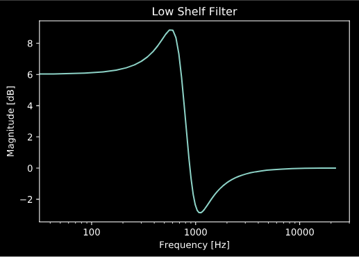

# Audio DSPy

[](https://circleci.com/gh/jatinchowdhury18/audio_dspy)
[](https://codecov.io/gh/jatinchowdhury18/audio_dspy)
[](https://www.codefactor.io/repository/github/jatinchowdhury18/audio_dspy)
[](https://audio-dspy.readthedocs.io/en/latest/?badge=latest)


audio_dspy is a Python package for audio signal processing tools.

Current tools include:
- EQ filter design
- Nonlinear Processors
- Sine Sweep Tools
- Plotting Frequency Responses and Static Curves
- Converting transfer functions to minimum or linear phase
- Prony's method, and Prony's method with frequency warping
- Modal modelling tools

Install using `pip`:
```bash
pip install audio-dspy
```

## Examples

```python
import audio_dspy as adsp
import matplotlib.pyplot as plt

# Plot nonlinear static curves
adsp.plot_static_curve (lambda x : adsp.hard_clipper (x), range=2.5)
adsp.plot_static_curve (lambda x : adsp.soft_clipper (x), range=2.5)
plt.title ('Comparing Nonlinearities')
plt.legend (['Hard Clipper', 'Soft Clipper'])
```


```python
# Design and plot EQ filters
fs = 44100
b, a = adsp.design_lowshelf (800, 2.0, 2, fs)
adsp.plot_magnitude_response (b, a, fs=fs)
plt.title ('Low Shelf Filter')
```


Further documentation coming soon...
